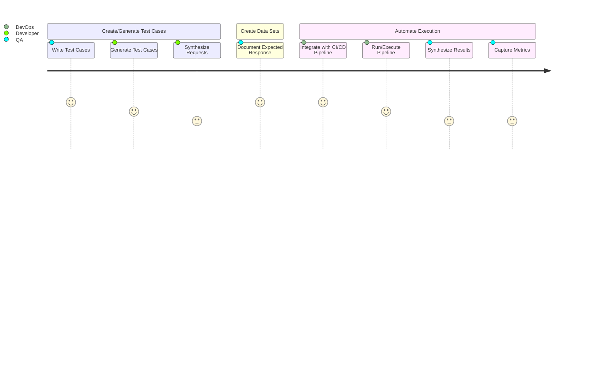

# RAG Pattern Knowledge Base

A repository to consolidate knowledge articles, patterns, white papers, relevant articles supporting RAG pattern.

## Design Patterns

### Pre-check/practices

- Entity Recognition
- PII Check

### Post-check

- Redaction

## Prompt Engineering

- [Step by step guide to learning Prompt Engineering](https://roadmap.sh/prompt-engineering)

## Prompt Flow

## Frameworks

## Vector Databases

## Whitepapers

- [RestGPT: Connecting Large Language Models with Real-World RESTful APIs](https://arxiv.org/pdf/2306.06624.pdf)

## Evaluation and Testing

### Measure LLM Performance

- Measure LLM Performance by integrating it in CI Pipeline (run parallel tests with prepared data sets)
- If customization is needed, writing your own Test Runner.

## Production Best Practices

- 