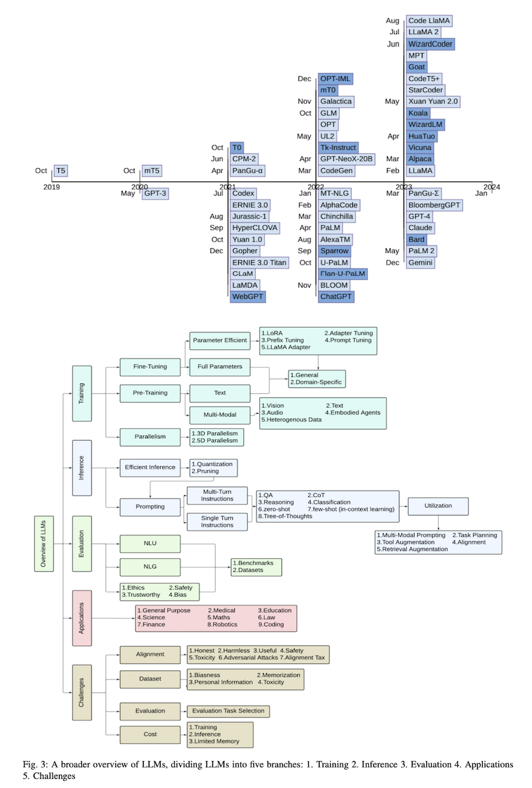
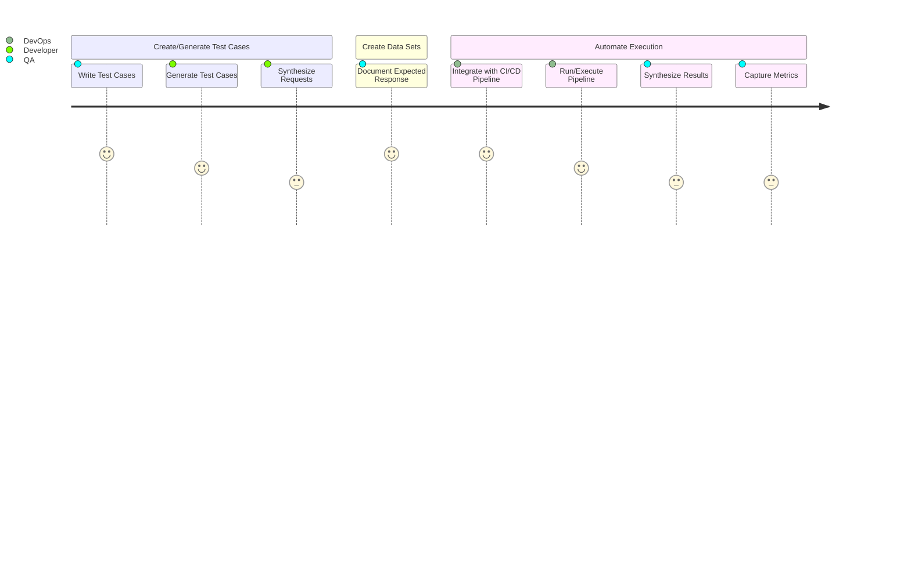

# RAG Pattern Knowledge Base

A repository to consolidate knowledge articles, patterns, white papers, relevant articles supporting RAG pattern.

## Fundamentals

- [A Comprehensive Overview of LLMs](https://arxiv.org/pdf/2307.06435.pdf)

- [Retrieval-Augmented Generation for Knowledge-Intensive NLP Tasks](https://arxiv.org/abs/2005.11401)

### Pre-check/practices

- Entity Recognition
- PII Check

### Post-check

- Redaction

## Prompt Engineering

- [Step by step guide to learning Prompt Engineering](https://roadmap.sh/prompt-engineering)

## Prompt Flow

## Frameworks

## Vector Databases

[Click here](VectorDatabases/index.md) for details on Vector Databases, to store embeddings for semantic search as part of RAG pattern.

## Whitepapers

- [RestGPT: Connecting Large Language Models with Real-World RESTful APIs](https://arxiv.org/pdf/2306.06624.pdf)
- [An LLM Compiler for Parallel Function Calling](https://arxiv.org/abs/2312.04511)
- [Self-RAG: Learning to Retrieve, Generate, and Critique through Self-Reflection](https://arxiv.org/abs/2310.11511)
- [AutoDev: Automated AI-Driven Development](https://arxiv.org/abs/2403.08299?)
- [LoRA: Low-Rank Adaptation of Large Language Models](https://arxiv.org/abs/2106.09685)

## Evaluation and Testing

### Measure LLM Performance

- Measure LLM Performance by integrating it in CI Pipeline (run parallel tests with prepared data sets)
- If customization is needed, writing your own Test Runner.

### LLM Evaluation Metrics

| Metric | Summary | References |
| -------|---------|------------|
| [BERTScore](https://openreview.net/pdf?id=SkeHuCVFDr) | BERTScore is a metric for automatic evaluation of machine translation that calculates the similarity between a machine translation output and a reference translation using sentence representation. BERTScore was invented as an improvement on n-gram-based metrics like BLEU.| [Hugging Face](https://huggingface.co/spaces/evaluate-metric/bertscore) |

## Production Best Practices

## Tools

| Area | Tool | Usage |
| -----|------|-------|
| LLM Evaluation | [Arthur Bench](https://www.arthur.ai/product/bench) | help teams evaluate the different LLM options out there in a quick, easy and consistent way |
| LLM Evaluation | [Evaluate](https://huggingface.co/docs/evaluate/index) | A Hugging Face library for easily evaluating machine learning models and datasets. |
